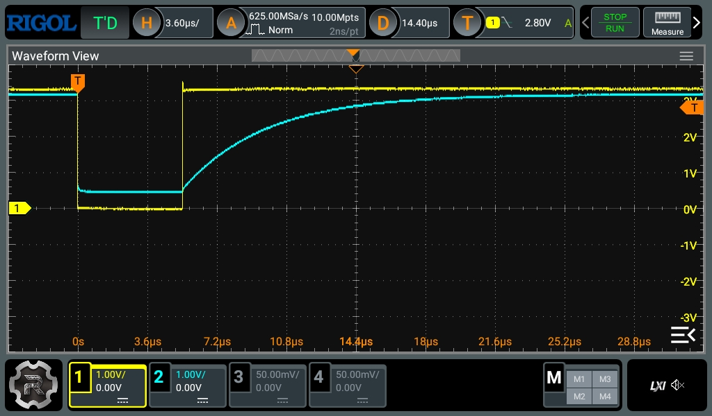
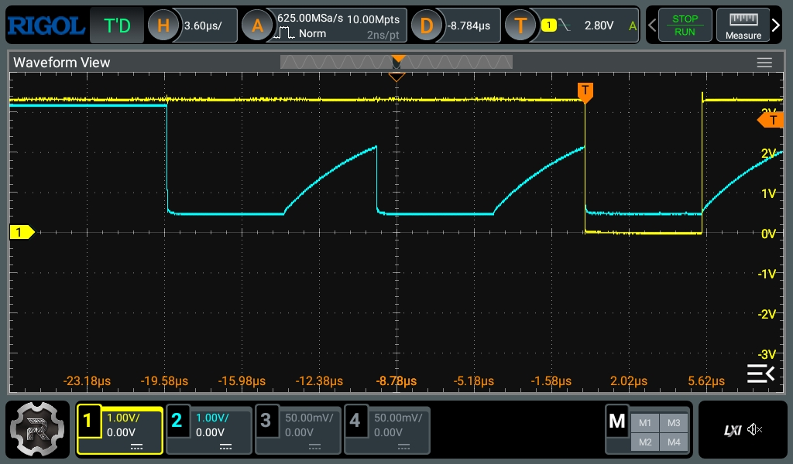
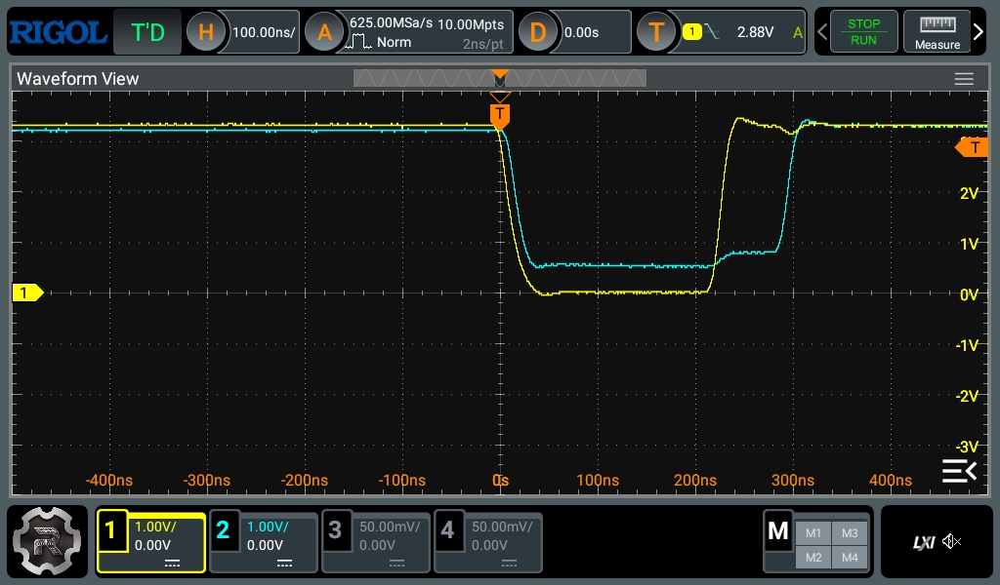

The following image is an oscilloscope screenshot of the scan of a row in a
testing keyboard that has a key pressed on a column in such row.

The yellow line represents the row pin. When the the row is being scanned, the
pin is pulled low, which makes the input column pin, the blue line, to become
low as well almost instantly. However, the column pin, instead of becoming full
up when the row is pulled high back again, it takes too much time to recover the
full Vdd voltage. I've guessed that this could be the root cause of some
ghosting in the keyboard, since the scanning of further rows will keep happening
while this pin is still trying to recover its voltage, like shown in the
following figure:

This picture shows three keys pressed simultaneously in the same column in
different rows. The yellow line only displays the scan of the third row,
although the shape of the scans of the other rows can be inferred from the
image. As it can be seen, the same column is being pulled low again because of
the presed keys, but without allowing it to reach Vdd before.

And as it can be seen, the recovery time is quite high, in the order of 15us to
be fully recovered. If this is considered a possible source of error, and we
need to wait 15 us for each row to be scanned, that would add up and make scan
times quite high in a real keyboard. Either we do an active wait, that would
probably take too much time, or we do some polling to the matrix, which will
make code more complex.

The root cause of this shape is a combination of the diode capacitance and the
impedance of the column when it is pulled up to Vdd. Usually, these switching
diodes commonly used in keyboards, such as the 1N4148, have a quite low
capacitance that shouldn't be a big deal generally. However, since the internal
resistor value used for pulling up the line is quite high, it makes longer the
times needed to recharge the diode capacitance, making it to have a voltage drop
for a while until it finishes.

The most straightforward, and stupid solution at the same time, is to, after the
output pin has been scanned, and all the input pins have been read, convert the
input pins into output pins, and write a high to them, so that it pulls the
diode up directly from Vdd without any impedance, making the charge times way
faster. The following image shows the effect of doing this in the line:

(Disregard the difference in timings when scanning the rows. These are different
because multiple changes have been done to the matrix scan between the images.
You get the point any way).

I originally considered this issue as the potential root cause for some ghosting
I was having in the keyboard. Now, I feel it has been severely reduced, although
I still feeling some slight key debouncing issues sometimes, so I guess this
change actually did something, but tbh not sure. Now at least it looks better.
