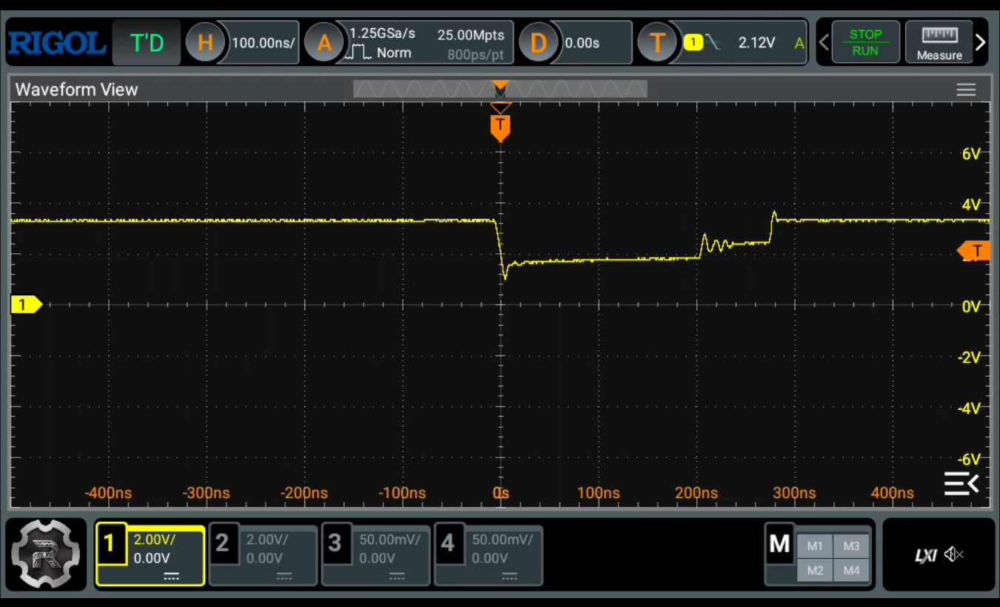
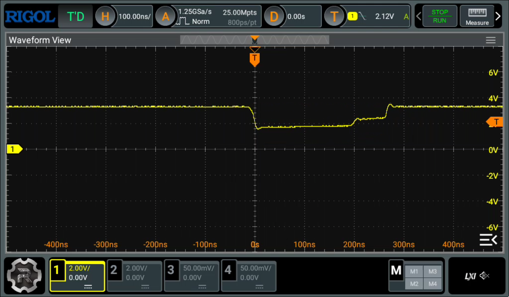

The following image shows how the signal of the column 3 is impacted by some
crosstalk that lowers the line unexpectedly from Vdd (3.30V) to < 2V, when
columns 2 and 4 become low (pressed) in a testing PCB keyboard:

The testing PCB keyboard is the [testing-split-kb](../testing-split-kb) PCB
connected in a breadboard to a Blackpill STM32F411CEU.

In this case, it looks like the firmware is detecting this as a ghost press.
According to STM32F411 datasheet, Vih (high-level input voltage) is 0.7Vdd =
2.31V and Vil (low-level input voltage) is 0.3Vdd = 0.99V. So 2V is kinda in the
non determined area, that could make pretty easily to take a low or a high value
almost randomly. Note that I needed to use a 10x probe for getting this
measurements because funnily the 1x was somehow interferring in the line and the
ghosting was not happening with it attached.

When changing the OSPEEDR value to low, I get the following results:

The image shows definitely a cleaner output without changing the position of the
probes at all. While the former shows more overshooting that this one, the
voltages grabbed by the oscilloscope are quite similar, although I'm not seeing
the issue anymore with this configuration. Not sure if the extra noise added
by the OSPEEDR set to high could produce these issues.

Anyway, in my "production" keyboard (a.k.a a Lily58 properly manufactured and
wired) this issue doesn't appear, because there's not even crosstalk in the
first place. Nevertheless I guess I should leave te OSPEEDR in low just to be
safer. There's no that much hurries :)

I guess some next steps include:
 - Maybe try in a better testing PCB, properly grounded, properly spaced, to see
   how frequent this issue could be.
 - Should I even consider switching from an active low logic to an active high?
   I originally used this one because it looks like it could be the kind of
   logic more resistant to any possible external interference, although since te
   Vih and Vil values to determine the high or low values in the GPIO inputs are
   not symmetric, maybe it could be better to use active high. Idk.
